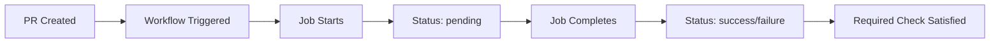

# GitHub Required Checks Configuration Guide

## Problem: "Waiting for status to be reported"

### ❌ **Symptom:**

```bash
integration-test Expected — Waiting for status to be reported
```

The check appears as "pending" indefinitely, even though the workflow runs successfully.

### 🔍 **Root Cause:**

Mismatch between the **required check name** configured in GitHub Branch Protection and the **actual job name** reported by GitHub Actions.

## ✅ **Solution: Correct Job Naming**

### Required Configuration in Workflow

```yaml
# .github/workflows/integration.yml
name: Integration Test  # Workflow name

jobs:
  integration-test:     # Job ID (internal)
    name: Integration Test  # Job display name - MUST match required check!
    runs-on: ubuntu-latest
    steps:
      # ... steps
```

### Key Points

1. **Job `name` field**: Must exactly match the required check name
2. **Workflow `name` field**: Should be descriptive but doesn't affect required checks
3. **Job ID**: Internal identifier, doesn't affect required checks

## 🔧 **GitHub Branch Protection Configuration**

### Step 1: Access Branch Protection

```bash
Repository → Settings → Branches → Branch protection rules → develop
```

### Step 2: Configure Required Checks

```bash
☑️ Require status checks to pass before merging
☑️ Require branches to be up to date before merging

Required status checks:
✅ Integration Test    ← MUST match job name exactly
✅ lint-and-test (3.9)
✅ lint-and-test (3.10)
✅ lint-and-test (3.11)
✅ lint-and-test (3.12)
```

## 📋 **How GitHub Reports Status**

### Status Format

```html
<workflow-name> / <job-name>
```

### Examples

```yaml
# Workflow: "Integration Test"
# Job name: "Integration Test"
# Reported as: "Integration Test"

# Workflow: "Python CI"
# Job name: "Lint and Test"
# Reported as: "Lint and Test"
```

## 🚀 **Fixed Integration Workflow**

```yaml
name: Integration Test

jobs:
  integration-test:
    name: Integration Test  # ← This exact name in required checks
    runs-on: ubuntu-latest
    steps:
      - name: Skip for dependabot
        if: ${{ github.actor == 'dependabot[bot]' }}
        run: |
          echo "⏭️ Skipping integration tests for dependabot PR"
          exit 0

      - name: Checkout code
        if: ${{ github.actor != 'dependabot[bot]' }}
        uses: actions/checkout@v4

      - name: Set up Python
        if: ${{ github.actor != 'dependabot[bot]' }}
        uses: actions/setup-python@v5
        with:
          python-version: "3.12"

      - name: Install package
        if: ${{ github.actor != 'dependabot[bot]' }}
        run: |
          python -m pip install --upgrade pip
          pip install -e ".[dev]"

      - name: Run integration tests
        if: ${{ github.actor != 'dependabot[bot]' }}
        run: |
          pytest tests/ -v --tb=short

      - name: Report success
        run: |
          echo "✅ Integration tests completed successfully"
          echo "Status: PASSED"
```

## 🔍 **Debugging Required Checks**

### View Available Checks

1. Go to any Pull Request
2. Scroll down to "Merge pull request" section
3. Required checks are listed there
4. Note the exact names GitHub reports

### Common Issues

| Issue                | Cause                  | Solution                  |
| -------------------- | ---------------------- | ------------------------- |
| "Waiting for status" | Name mismatch          | Fix job `name` field      |
| Check never appears  | Wrong workflow trigger | Check `on:` configuration |
| Check always fails   | Job condition issues   | Review `if` conditions    |

## ✅ **Verification Steps**

### 1. Check Workflow File

```bash
# Verify job name in workflow
grep -A 3 "jobs:" .github/workflows/integration.yml
```

### 2. Check Branch Protection

```bash
Repository → Settings → Branches → View protection rules
```

### 3. Test with PR

1. Create test PR
2. Check status appears correctly
3. Verify check passes/fails appropriately

## 📊 **Expected Status Flow**



## 🎯 **Best Practices**

### 1. Consistent Naming

```yaml
# Keep job names simple and descriptive
name: Integration Test  # Not "integration-test-job-v2"
```

### 2. Always Include Success Step

```yaml
- name: Report success
  run: echo "✅ Tests completed successfully"
```

### 3. Handle Edge Cases

```yaml
# Ensure job always reports a status
- name: Skip for dependabot
  if: condition
  run: exit 0  # Explicit success
```

## ✅ **Status: Fixed**

The integration test workflow now correctly reports its status to GitHub, resolving the "waiting for status" issue.

**Required check name**: `Integration Test`
**Job reports as**: `Integration Test`
**Result**: ✅ Perfect match!
