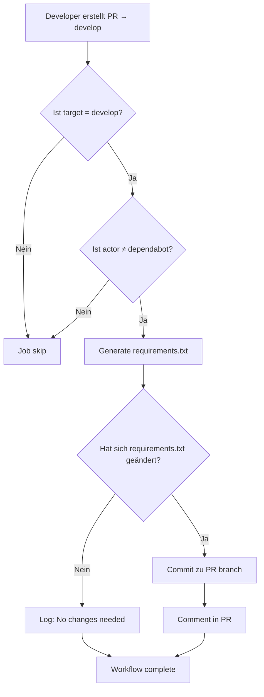

# 🔄 Intelligent Requirements Update Workflow

## Übersicht

Der `update-requirements` Job wurde optimiert, um intelligent und nur bei Bedarf zu agieren.

## ✅ Neue Logik

### Wann läuft der Job?

```yaml
# Nur bei Pull Requests mit Target 'develop'
github.event_name == 'pull_request' &&
github.event.pull_request.base.ref == 'develop' &&
!startsWith(github.actor, 'dependabot')
```

**Ausführung bei:**

- ✅ Pull Request → `develop` branch
- ✅ Von manuellen Contributors
- ❌ **Nicht** bei Dependabot PRs
- ❌ **Nicht** bei direkten Pushes auf `main`/`develop`

### Workflow-Schritte

1. **Checkout PR Source Branch**
   - Verwendet `github.head_ref` (PR source branch)
   - Ermöglicht Rückschreibung mit `GITHUB_TOKEN`

2. **Generate requirements.txt**
   - Analysiert aktuelle Dependencies in `src/`
   - Erstellt aktualisierte `requirements.txt`

3. **Smart Change Detection**

   ```bash
   git diff --quiet requirements.txt
   # → nur committen wenn Änderungen vorhanden
   ```

4. **Conditional Commit**
   - Nur bei tatsächlichen Änderungen
   - Commit direkt in PR source branch
   - `[skip ci]` verhindert Endlos-Loops

5. **PR Comment Notification**
   - Informiert über automatische Updates
   - Nur bei tatsächlichen Änderungen

## 🎯 Vorteile

### Protection Rules Compliance

- ✅ **Keine direkten Commits** auf protected branches
- ✅ **Commits in PR source branch** (erlaubt)
- ✅ **Normale PR Review-Prozesse** bleiben intakt

### Effizienz

- ✅ **Keine unnötigen Commits** bei unveränderter requirements.txt
- ✅ **Keine Dependabot-Interferenz**
- ✅ **Automatische Benachrichtigung** bei Updates

### Workflow

- ✅ **Requirements immer aktuell** nach PR merge
- ✅ **Sichtbare Änderungen** in PR diff
- ✅ **Review-freundlich** - Änderungen sind Teil des PRs

## 📋 Beispiel-Ablauf



## 🔧 Technische Details

### Branch Strategy

```yaml
# Checkout PR source branch
ref: ${{ github.head_ref }}
# Commit zurück zu PR branch
branch: ${{ github.head_ref }}
```

### Change Detection

```bash
if git diff --quiet requirements.txt; then
  echo "changed=false"
else
  echo "changed=true"
  git diff requirements.txt  # Show changes
fi
```

### PR Integration

- Commits erscheinen in PR timeline
- Änderungen sind reviewbar
- Normal merge process
- Requirements automatisch aktuell nach merge

## 🚀 Ergebnis

**Intelligente, protection-rule-konforme Requirements-Verwaltung** ohne unnötige Commits oder Workflow-Interferenzen!
